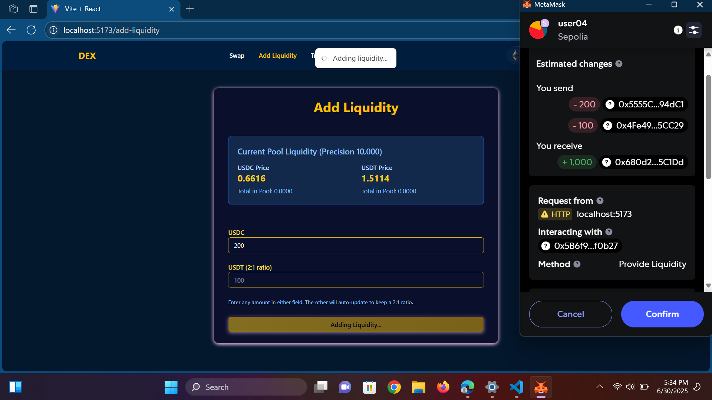
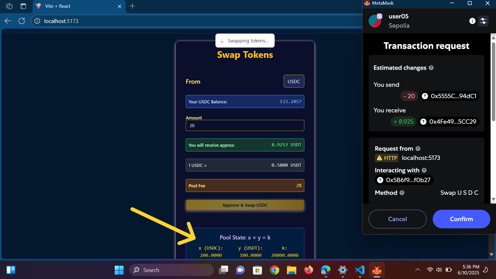
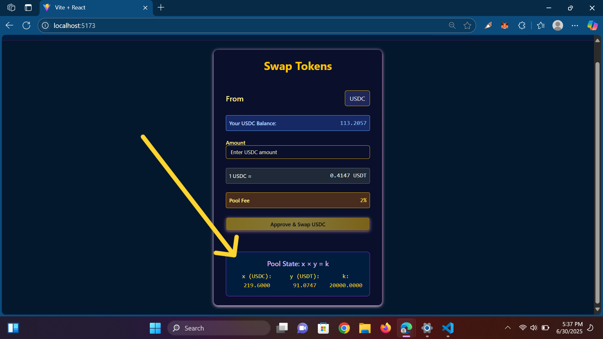
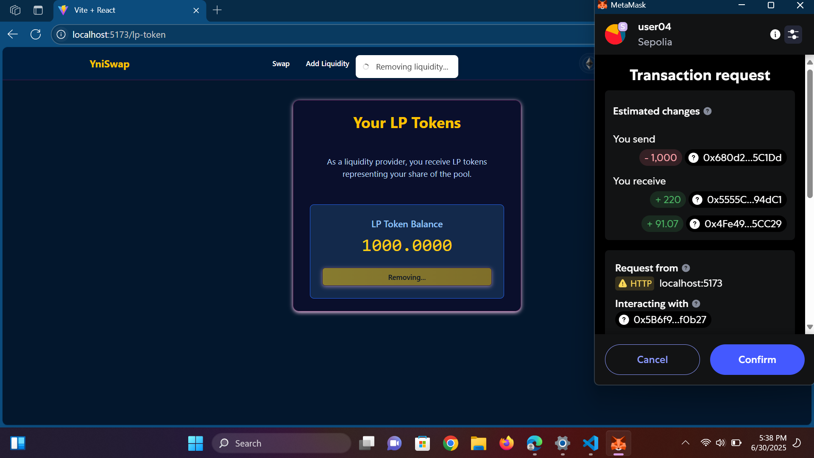

# 💱 YniSwap – A Minimal DEX for Mock Tokens (USDC & USDT)

## 🖼️ Screenshots & Flow

### 1️⃣ Add Liquidity

**🧪 Features**
- Enter USDC or USDT, the 2:1 ratio auto-syncs
- Approve both tokens
- Add to pool, receive LP tokens

**📸 UI:**

---

### 2️⃣ Swap Tokens

Swap either USDC or USDT using constant product formula. Price changes dynamically based on current pool state.

**📈 Note:** The `k = x * y` value before swapping is displayed for reference.

**📸 UI Before Swapping (highlight `k`)**

---

### 3️⃣ After Swap

After a successful swap, the pool adjusts token balances and updates the constant `k`. This reflects the AMM curve shift.

**📸 UI After Swapping (`k` should change):**

---

### 4️⃣ Remove Liquidity

Users can remove liquidity by burning their LP tokens. Upon successful removal, USDC and USDT are returned in proportion.

**📸 UI:**

---
YniSwap is a simple decentralized exchange (DEX) that allows users to:
- Add liquidity to a USDC/USDT pool
- Perform token swaps based on the x * y = k constant product formula
- Remove liquidity and receive back their assets

> Built using **React**, **Wagmi**, and **AppKit** with mock ERC-20 tokens on a testnet or local network.

---

---

## 📦 Technologies Used

- [React](https://reactjs.org/)
- [Tailwind CSS](https://tailwindcss.com/)
- [Wagmi](https://wagmi.sh/)
- [ViEM](https://viem.sh/)
- [React Hot Toast](https://react-hot-toast.com/)
- [AppKit by Reown](https://github.com/reown-app/appkit)

# 💼 Contact for Consultation & Collaboration

**Name:** Qasim  
📇 [LinkedIn Profile](https://www.linkedin.com/in/qasim-ikram-portfolio/)

